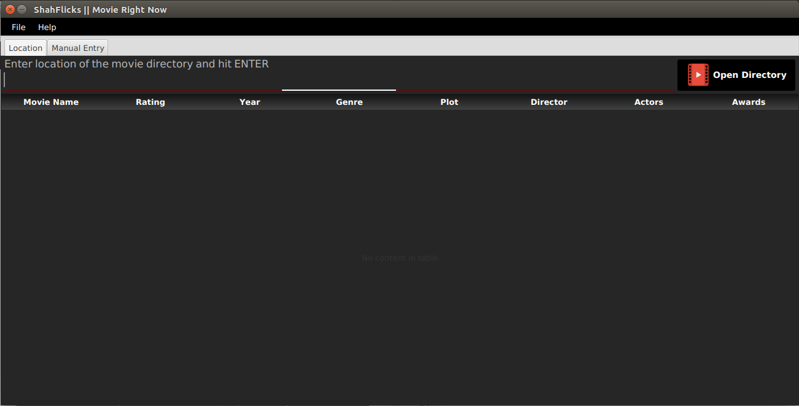
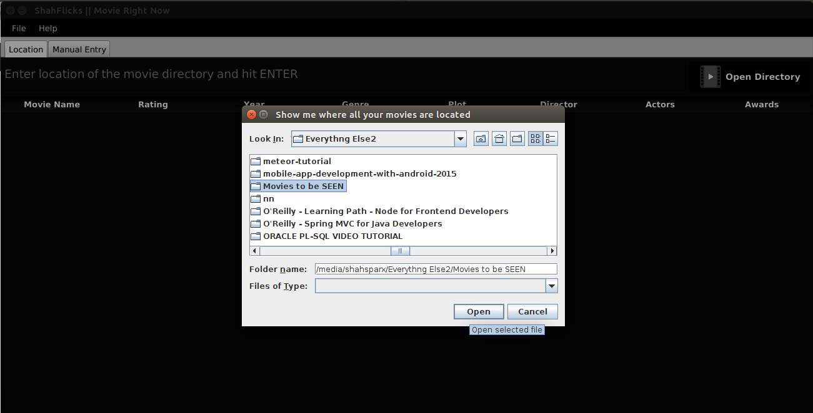
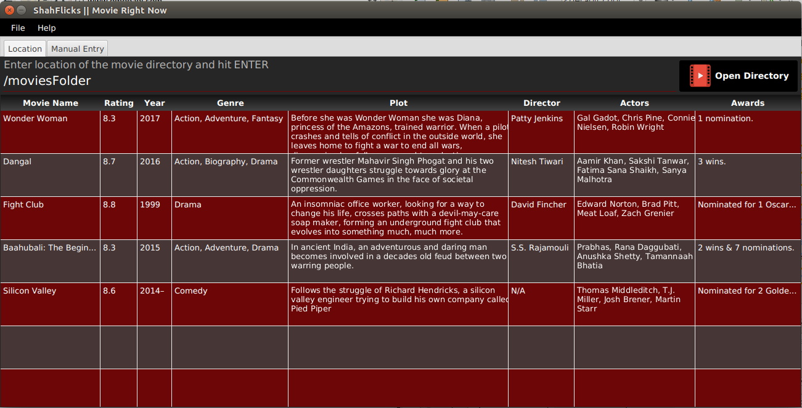
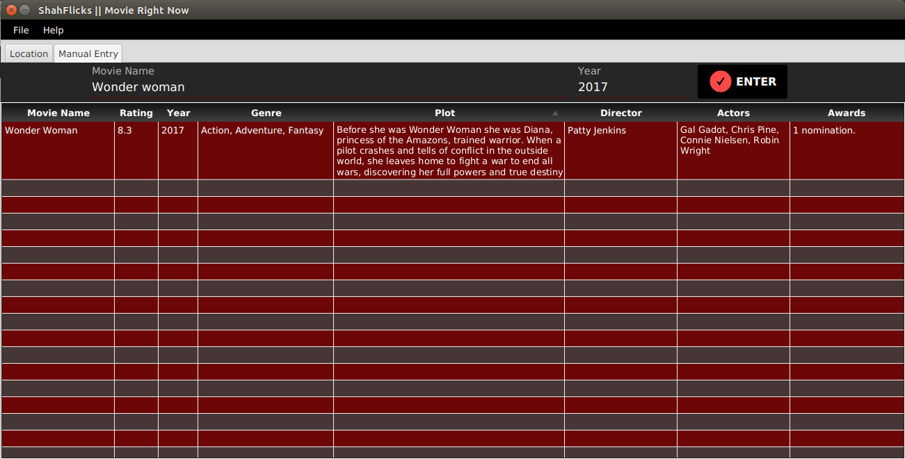
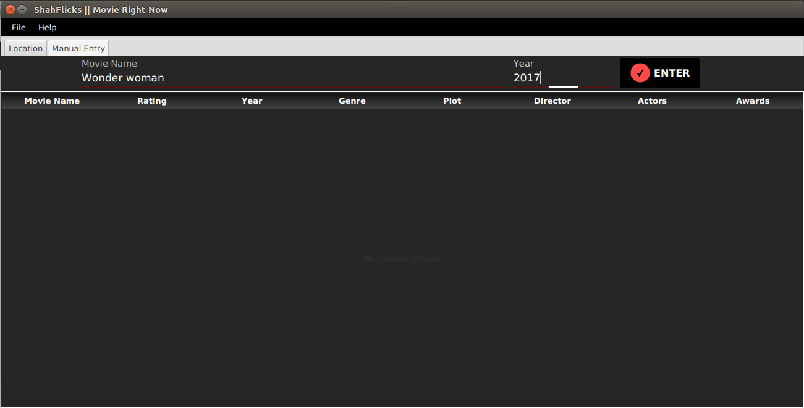

# MovieRightNow
ShahFlicks || MRN saves a ton of time of movieholics who have a huge collection of movies on their Drive, and it takes up a lot of time to decide on what movie to watch every time.

ShahFlicks || MRN utilises the OMDB API to fetch the movie details.
All requests are individual requests and no batch requests.

OMDB API now requires an API key, i.e, you have to pay atleast 1$ monthly to ustilise the API, so you are requested to become
a patron and get your API key to use this service.

http://www.omdbapi.com/

Become a patron here  : https://www.patreon.com/bePatron?u=5038490
Request for a key here after becoming a patron   : http://www.omdbapi.com/apikey.aspx

